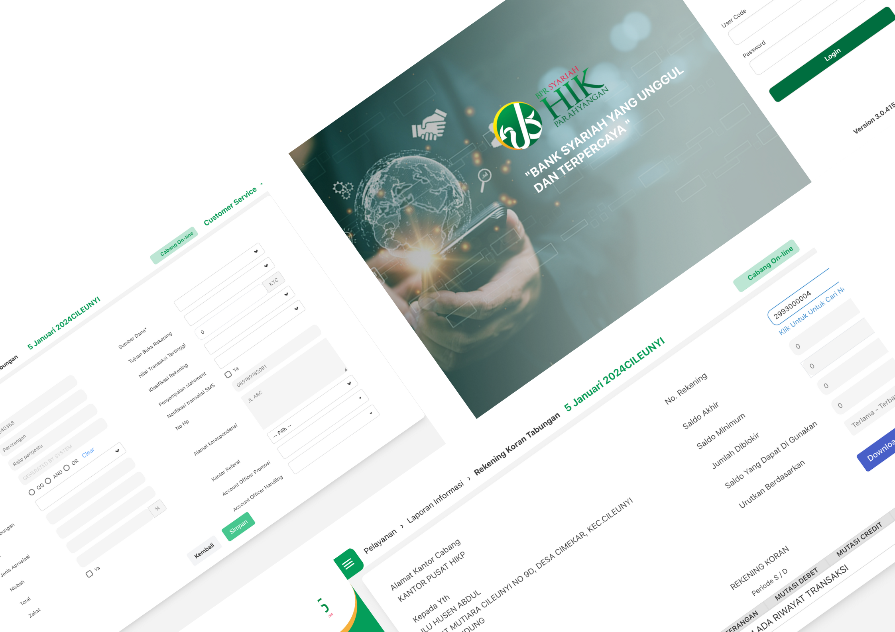
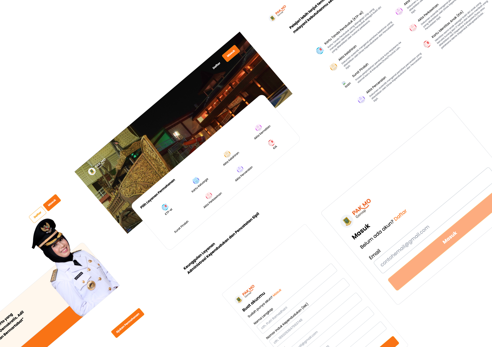
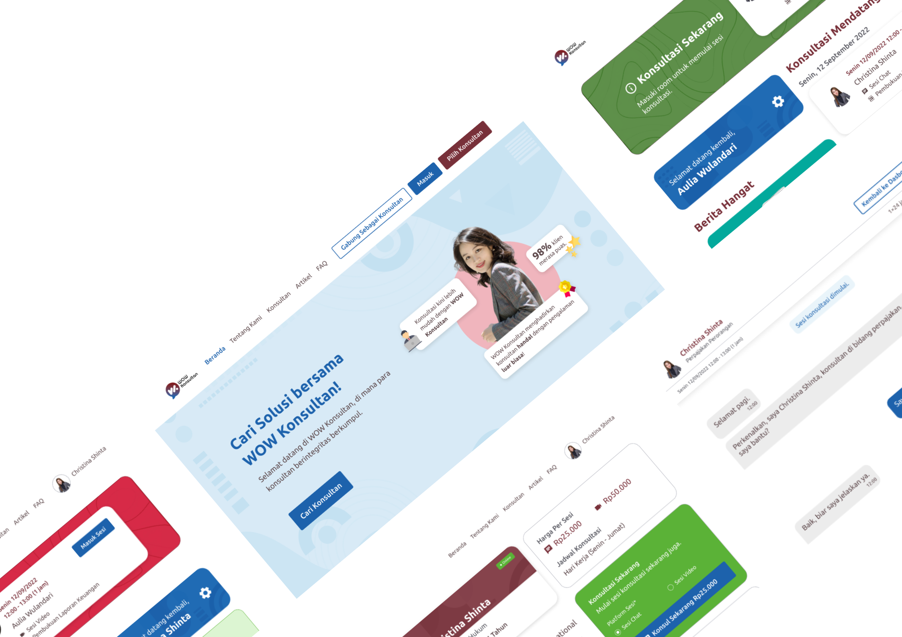
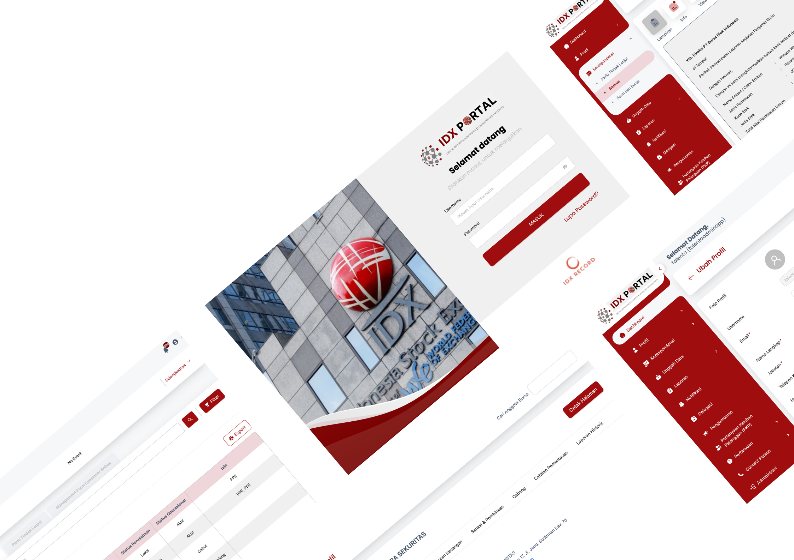
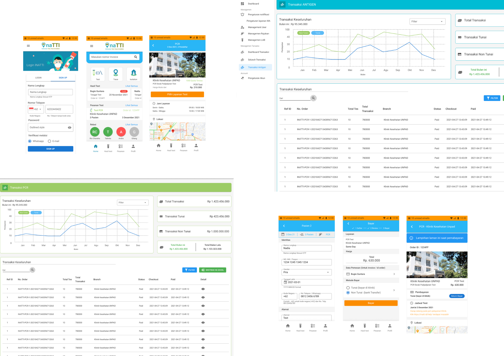
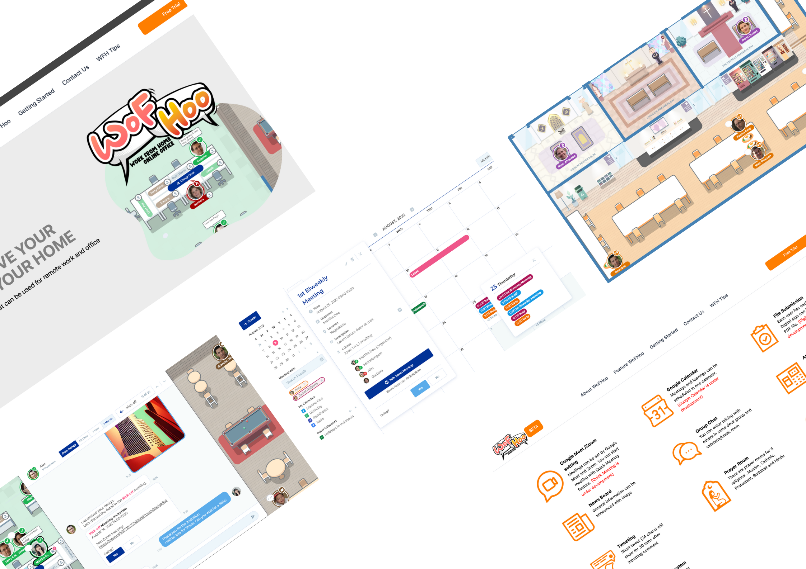
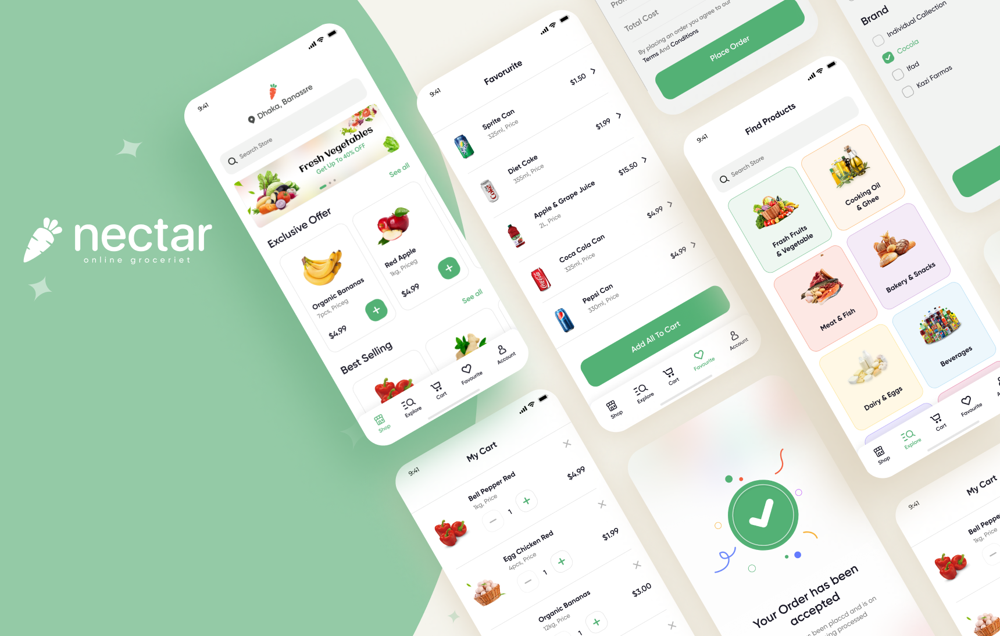

#### 1. BPRS HIK Parahyangan (Online Integrated Banking Sharia System)

Web-based core banking system to accommodate banking operations with sharia concepts

#### 2. PAKMO Mojokerto

Web-based population administration by mojokerto local goverment for making identity cards, certificates and other things that are completely done online

#### 3. WOW Konsultan

B2C platform that brings together consultants and customers for activities such as business, legal and tax consulting enabling synchronous video calls & chats

#### 4. Bursa Efek Indonesia (Indonesian Stock Exhange Portal)

Web-based administration portal of internal indonesian stock exchange members

#### 5. [Inatti](https://inatti.id)

Online COVID-19 test apps have been crucial in enhancing the responsiveness of health systems to the pandemic. 

#### 6. [Wofhoo](https://wofhoo.com)

Empowers teams to collaborate, communicate, and innovate without the constraints of a physical office. Join the future of work with our virtual office application and experience a new level of productivity and engagement.

#### 7. Nectar (Android & IOS)

Online grocery apps make shopping for groceries easy and convenient
